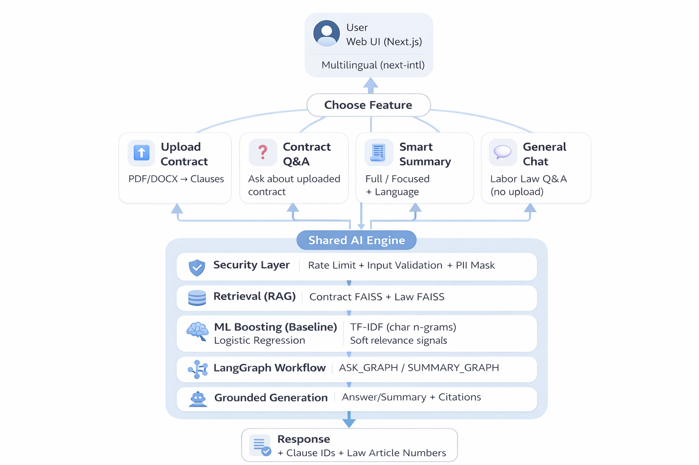
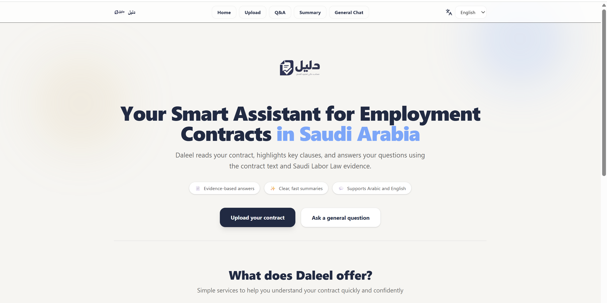
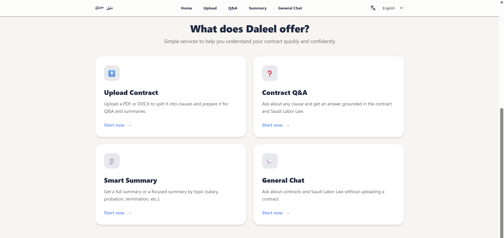
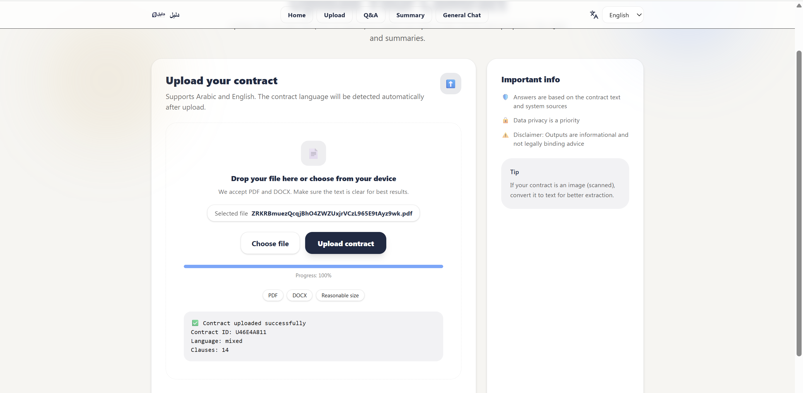
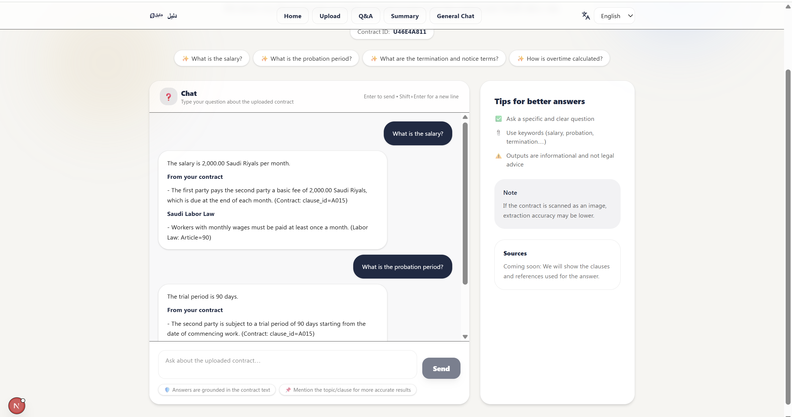
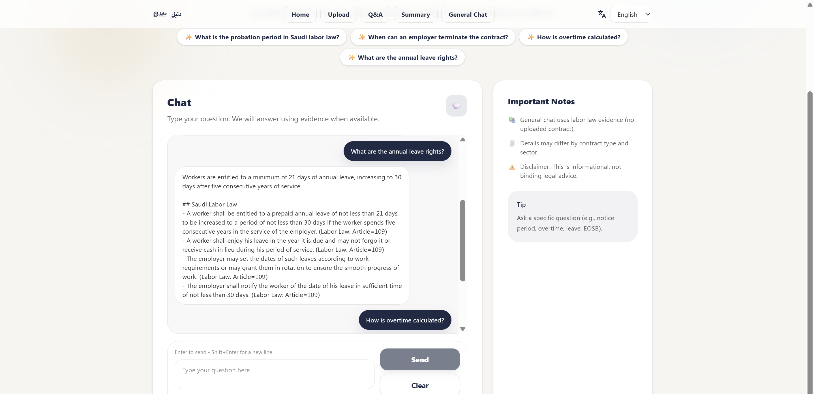
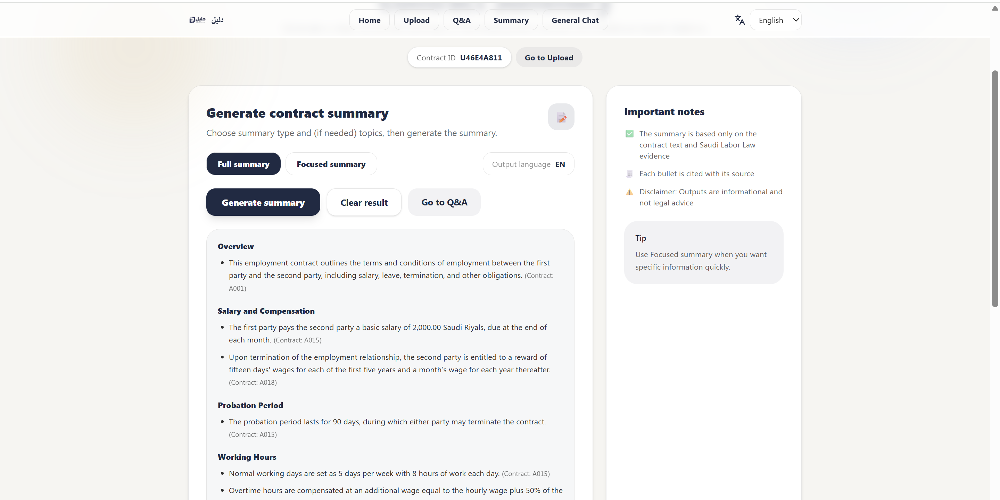

# Daleel (دليل) — Intelligent Contract Understanding for Saudi Employment Contracts

Daleel is a bilingual, AI-powered system designed to help employees and employers in Saudi Arabia understand employment contracts clearly and confidently.  
It analyzes uploaded employment contracts (Arabic/English), breaks them into structured clauses, and enables:

- **Contract Q&A** grounded in the uploaded contract + Saudi Labor Law  
- **Smart Summary** (Full / Focused by topic) in multiple UI languages  
- **General Labor Law Chat** (no contract upload required)

> **UI Languages Supported:** Arabic, English, Urdu, Hindi, Filipino

---

## Key Features

### 1) Upload Contract (PDF/DOCX → Clauses)
- Upload an employment contract (PDF/DOCX)
- Extracts and chunks content into clause-like segments
- Stores a per-contract index for retrieval

### 2) Contract Q&A (Grounded)
- Ask questions about the uploaded contract (e.g., salary, probation, working hours)
- Answers include:
  - **Contract evidence** (clause IDs)
  - **Law evidence** (article numbers)

### 3) Smart Summary
- **Full Summary:** covers all major sections
- **Focused Summary:** user selects topics (e.g., Salary, Probation, Termination)
- Output is structured and grounded in retrieved evidence

### 4) General Chat (Labor Law)
- Ask Saudi labor-law questions without uploading a contract
- Grounded in the Labor Law dataset (retrieval + citations)

---

## Security & Safety
This project includes a security-focused layer to reduce risks and improve reliability:
- **Rate limiting** per IP for heavy endpoints (Ask/Summary)
- **Input guardrails** (basic validation / prompt safety constraints)
- **PII masking** to redact sensitive information in responses (e.g., phone numbers, national IDs, emails)

---

## High-Level Architecture

### System Overview
- **Frontend:** Next.js multilingual UI (language switcher)
- **Backend:** FastAPI service
- **Retrieval (RAG):**
  - Contract FAISS index (per uploaded contract)
  - Law FAISS index (Saudi Labor Law)
- **ML baseline (supporting signal):**
  - TF-IDF (char n-grams) + Logistic Regression (baseline label signal / soft relevance support)
- **LangGraph workflows:**
  - ASK_GRAPH for Q&A
  - SUMMARY_GRAPH for summaries
- **Generation:**
  - Grounded answer/summary with citations

### Diagram
> Place your architecture image here (already prepared):

---

## Tech Stack
**Frontend**
- Next.js (App Router)
- next-intl (multilingual UI)
- Tailwind CSS

**Backend**
- FastAPI + Uvicorn
- FAISS (vector search)
- Sentence-Transformers (embeddings)
- PyMuPDF (PDF parsing), python-docx (DOCX parsing)

**ML (Baseline)**
- scikit-learn: TF-IDF + Logistic Regression

**Agent Orchestration**
- LangGraph (ASK_GRAPH / SUMMARY_GRAPH)

---

## Repository Structure

CONTRACT-AI/
  backend/
    api/                 # FastAPI routers (upload, ask, summary, health)
    agents/              # LangGraph graphs + tools/state
    rag/                 # RAG engine (contract + law retrieval)
    services/            # parsing + chunking
    ml/                  # training + inference (TF-IDF baseline)
    security/            # PII masking, rate limit, guardrails
    artifacts/           # model artifacts (vectorizers, logreg, etc.)
    data/                # datasets used for training / examples
    main.py              # FastAPI entrypoint
  web/                   # Next.js UI
  Labor/                 # law resources (if included)
  requirements.txt
  README.md

## User Interface Screenshots

### Home Page

### Home Page (Alternative View)

### Upload Contract

### Contract Q&A

### Labor Law Q&A (No Upload)

### Smart Summary (Full / Focused)

## Supported Languages (UI)

Daleel supports the following user interface languages:

- Arabic 🇸🇦
- English 🇬🇧
- Urdu 🇵🇰
- Hindi 🇮🇳
- Filipino 🇵🇭

Language selection is available directly from the UI and applies to:
- Contract Q&A
- Smart Summary
- General Labor Law Chat

## Setup & Installation

### Prerequisites
- Python 3.10+
- Node.js 18+
- Git

---

### Backend Setup (FastAPI)

git clone https://github.com/MayyanAlharbi/Daleel_AI-Assistant.git
cd Daleel_AI-Assistant

python -m venv .venv
source .venv/bin/activate   # Windows: .venv\Scripts\activate

pip install -r requirements.txt

cd backend
uvicorn main:app --reload

### Backend runs at:

http://localhost:8000

Frontend Setup (Next.js)
cd web
npm install
npm run dev

### Frontend runs at:

http://localhost:3000

Environment Variables

Create a .env file in the project root:

OPENAI_API_KEY=your_api_key_here

### ⚠️ Important:
Do NOT commit .env files. Make sure .env is listed in .gitignore.

---

## Author

Mayyan Alharbi
Artificial Intelligence Graduate
Saudi Arabia 🇸🇦

GitHub: https://github.com/MayyanAlharbi

---

## Contributions

Contributions are welcome, especially for:

Improving RAG retrieval quality

Enhancing clause classification accuracy

UI/UX improvements

Security and performance enhancements

Extending Saudi labor-law coverage
